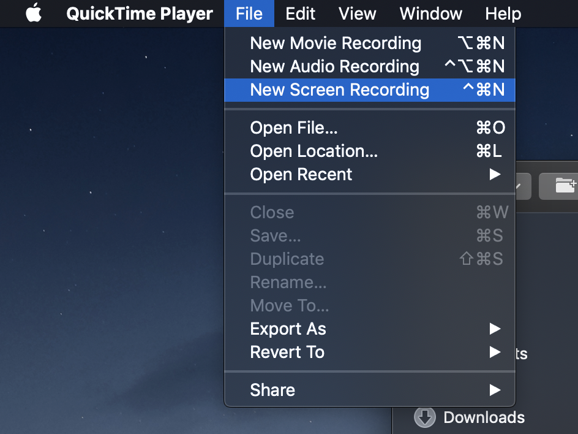
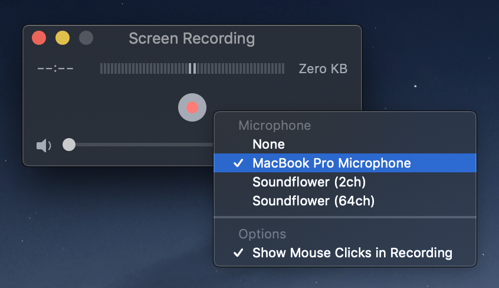
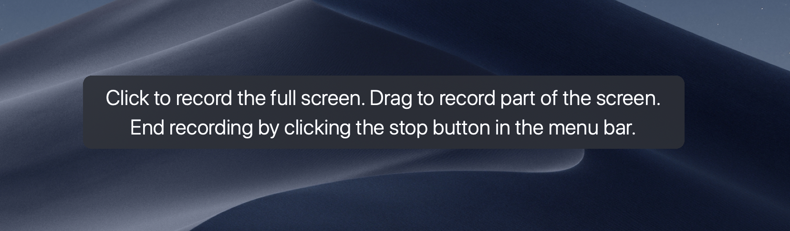

# Ada Screencasts

## Creating a screencast (mac only)

1. Install [keycastr](https://github.com/keycastr/keycastr) - keycastr lets you
   show your keystrokes on screen
2. Open quicktime player and go to File > New Screen Recording
   
3. Click the small arrow next to the record button and make sure your microphone
   is selected, as well as 'show mouse clicks in recording'
   
4. Click the red record button. **IMPORTANT:** you're not recording yet - I made
   this mistake and lost an hour of recording. You need to click on this thing
   to start the recording: 
5. Record a thing! End the recording when you're done. One thing I like to do is
   make a note as I'm going where I want to edit things out. That way, I don't
   have to watch the video all the way through to edit out my mistakes!
6. Repeat for each section
7. Edit your screencast together - I've been just using iMovie for this & export
   it to a file
8. iMovie (idk about other video software) spits out a pretty huge file. We can
   compress it much further without much loss of quality with `ffmpeg`. Run
   `ffmpeg -i your-original-video.mp4 compressed-output.mp4` (install ffmpeg
   with `brew install ffmpeg`) to compress your video - usually this results in
   a file about 10% of the size of the original

## Add a screencast to this project

1. Make sure your video has been run through `ffmpeg` as above
1. Upload your video to youtube
   - this is good as a backup, and lets us use youtube's auto-generated
     subtitles
1. Upload your video to S3 (or some other file hosting thing)
   - we need to do this because GitHub won't let us upload files over 100mb. we
     specify two video source in the html file so it first tries to use a local
     video, and falls back to S3 if it's not there.
1. Copy one of the existing screencast folders (e.g. `oo-js`) and rename it for
   your own screencast
1. Delete `captions.vtt` in your screencast folder
1. Replace `rendered.mp4` in your screencast folder with your own video
1. Open up `index.html` and make the following changes:
   - The `<title>` (line 5ish)
   - The heading `<h1>` (line 75ish)
   - The local video `<source src>` if it's not called 'rendered.mp4' (line
     77ish)
   - The hosted video `<source src>` on S3 (line 78ish)
   - The `<form action>` - the last part of the URL should be the name of your
     screencast (line 90ish)
1. Add a new `captions.vtt`
   - Some time after uploading your video to youtube (I usually leave it over
     night), captions will be available on your youtube video. check for the
     icon in the youtube player
   - Download the subtitles. I've been using http://www.yousubtitles.com/ but
     its a bit rubbish
   - Covert the subtitles to WebVTT - I've been using
     https://atelier.u-sub.net/srt2vtt/
   - Add the file as `captions.vtt` to your screencast folder
1. Add a link to the root `index.html`
1. Commit and push! **Note:** there's a `.gitignore` rule excluding `.mp4` rules
   as otherwise we can't upload to github. make sure you've included a working
   S3 link!
